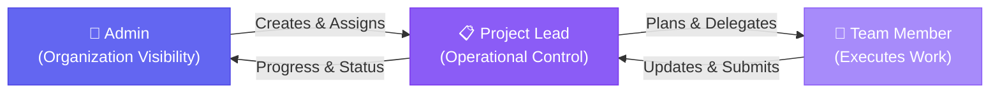
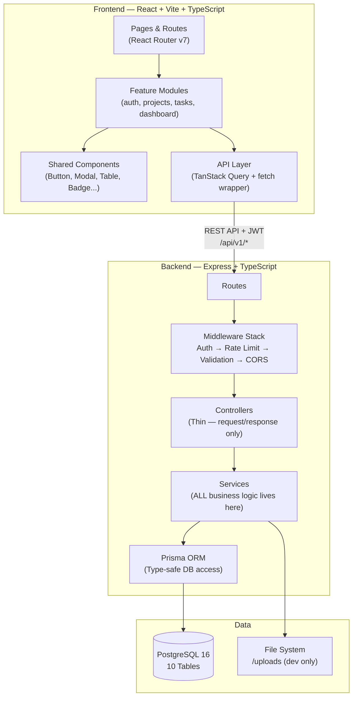
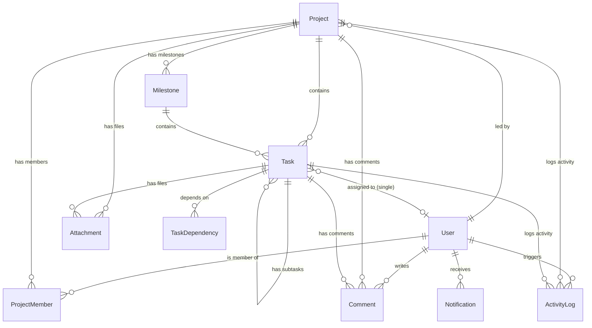

# Project Tracker & Digital Team Management Platform
# Implementation Plan — Revision 2.1 (Final)

> **Revision 2.1** incorporates all feedback from both expert reviews. Every critique has been addressed. A detailed changelog is at the bottom.

---

## 1. Problem & Vision

The organization's Digital Head manages ~40–50 students/employees across diverse digital projects. The Admin **cannot** personally create, assign, schedule, monitor, and review every task across every project.

**Core value:** A three-tier delegation system — **Admin → Project Lead → Team Member** — with centralized visibility flowing upward and operational control flowing downward.



This is **not** a generic Jira/Trello clone. It solves this organization's specific delegation problem.

---

## 2. Design Decisions (All Confirmed)

All 5 decisions are now **finalized** based on the expert review. No open questions remain.

### ✅ Decision 1: One Primary Project Lead Per Project
One owner per project. Clear accountability, one decision-maker. The `project_members` table supports adding a `CO_LEAD` role in the future if needed — zero schema changes required.

### ✅ Decision 2: Admin Creates Users (No Self-Registration)
Admin creates user accounts with email, name, and role. User receives credentials from Admin and **must change password on first login** (`must_change_password` flag). No public self-registration — the organization has only ~50 people, open registration creates security risk.

> [!NOTE]
> **Why not invite links in v1?** Invite links require the Admin to copy/share a URL, which is essentially the same friction as sharing initial credentials. A simpler flow for v1: Admin creates account → shares credentials → user logs in → forced password change. Invite-link flow can be added in v2 for a more polished onboarding experience.

### ✅ Decision 3: Single Assignee Per Task
Each task has exactly **one** assignee. When multiple people need to work on something, use subtasks:

```
Task: Build Authentication
├── Subtask: Login UI       → Amit
├── Subtask: JWT Backend    → Rahul
└── Subtask: Testing        → Priya
```

**Why:** Single assignee provides clear ownership. Workload calculation is unambiguous — one task, one person, one workload entry. No confusion about "who gets credit" or "whose dashboard shows this." Subtasks naturally decompose collaborative work.

**Schema impact:** `assignee_id` lives directly on the `tasks` table instead of a separate `task_assignments` junction table. Eliminates one table entirely.

### ✅ Decision 4: Soft Delete Only
Projects are never permanently deleted. "Deleting" a project sets its status to `CANCELLED`. All data (tasks, comments, files, activity logs) is preserved. An Admin can filter out cancelled projects from views but the data remains for auditing and accountability.

### ✅ Decision 5: Database
PostgreSQL is the approved database. Development may use locally installed PostgreSQL or Docker. Setup documentation will include both options.

---

## 3. Technology Stack

### 3.1 Approved Packages

| Layer | Technology | Version | Why |
|-------|-----------|---------|-----|
| **Frontend Framework** | React | 19 | Component architecture, massive ecosystem |
| **Build Tool** | Vite | 6.x | Fast dev server, optimized builds |
| **Language** | TypeScript | 5.x | Type safety across full stack |
| **Frontend Routing** | React Router | v7 | Industry standard SPA routing |
| **Server State** | TanStack Query | v5 | Caching, refetching, loading/error/empty states |
| **Client State** | Zustand | 5.x | **Only** for auth token + sidebar collapse state |
| **Icons** | Lucide React | latest | Consistent, lightweight, tree-shakeable |
| **Backend Framework** | Express.js | 4.x | Mature, flexible, middleware ecosystem |
| **ORM** | Prisma | v7 | Type-safe client, declarative schema, migrations |
| **Database** | PostgreSQL | 16 | Relational integrity, JSONB, excellent performance |
| **Auth - Hashing** | bcryptjs | latest | Pure JS (no native build issues on Windows) |
| **Auth - Tokens** | jsonwebtoken | latest | JWT access + refresh tokens |
| **Validation** | Zod | 3.x | Runtime validation, shared frontend/backend schemas |
| **Logging** | Winston | 3.x | Structured JSON logging |
| **File Upload** | Multer | 1.x | Express multipart form-data handling |
| **Rate Limiting** | express-rate-limit | 7.x | Auth endpoint brute-force protection |
| **CORS** | cors | 2.x | Cross-origin requests in development |

> [!IMPORTANT]
> **Axios removed.** TanStack Query works with the native `fetch()` API. A thin wrapper function around `fetch()` with JWT header injection is simpler and eliminates one dependency. The JWT refresh interceptor will be implemented as a custom `fetch` wrapper in `shared/utils/api.ts`.

### 3.2 Explicitly NOT Installing

| Technology | Reason | When to Add |
|-----------|--------|-------------|
| Axios | `fetch()` + TanStack Query is sufficient | Only if fetch wrapper becomes unwieldy |
| Redis | JWT is stateless, no caching at 50 users | When response times need caching |
| BullMQ | No background jobs in v1 | When email notifications are added |
| Socket.IO | TanStack Query polling suffices | When real-time updates are requested |
| TailwindCSS | Vanilla CSS design-token system | Only if user requests it |
| helmet | Security headers — deferred to Phase 6 polish | Phase 6 |

---

## 4. Architecture

### 4.1 System Architecture



### 4.2 Backend Structure

```
backend/
├── prisma/
│   ├── schema.prisma              # Database schema (10 tables)
│   ├── seed.ts                    # Default Admin user
│   └── migrations/
├── uploads/                       # File storage (DEV ONLY — use object storage in production)
├── src/
│   ├── config/
│   │   ├── env.ts                 # Zod-validated environment variables (fail-fast)
│   │   ├── database.ts            # Prisma client singleton
│   │   └── constants.ts           # App-wide constants
│   ├── middleware/
│   │   ├── auth.middleware.ts      # JWT verification + user extraction
│   │   ├── rbac.middleware.ts      # Role-based access control
│   │   ├── projectAccess.middleware.ts  # Project membership verification
│   │   ├── validation.middleware.ts # Zod schema validation
│   │   ├── upload.middleware.ts     # Multer config (size, type limits)
│   │   ├── rateLimiter.middleware.ts # Rate limiting for auth routes
│   │   └── error.middleware.ts     # Global error handler
│   ├── modules/
│   │   ├── auth/
│   │   │   ├── auth.routes.ts
│   │   │   ├── auth.controller.ts
│   │   │   ├── auth.service.ts
│   │   │   └── auth.validation.ts
│   │   ├── user/
│   │   │   ├── user.routes.ts
│   │   │   ├── user.controller.ts
│   │   │   ├── user.service.ts
│   │   │   └── user.validation.ts
│   │   ├── project/
│   │   │   ├── project.routes.ts
│   │   │   ├── project.controller.ts
│   │   │   ├── project.service.ts
│   │   │   └── project.validation.ts
│   │   ├── milestone/
│   │   │   ├── milestone.routes.ts
│   │   │   ├── milestone.controller.ts
│   │   │   ├── milestone.service.ts
│   │   │   └── milestone.validation.ts
│   │   ├── task/
│   │   │   ├── task.routes.ts
│   │   │   ├── task.controller.ts
│   │   │   ├── task.service.ts
│   │   │   └── task.validation.ts
│   │   ├── comment/
│   │   │   ├── comment.routes.ts
│   │   │   ├── comment.controller.ts
│   │   │   └── comment.service.ts
│   │   ├── attachment/
│   │   │   ├── attachment.routes.ts
│   │   │   ├── attachment.controller.ts
│   │   │   └── attachment.service.ts
│   │   ├── notification/
│   │   │   ├── notification.routes.ts
│   │   │   ├── notification.controller.ts
│   │   │   └── notification.service.ts
│   │   ├── dashboard/
│   │   │   ├── dashboard.routes.ts
│   │   │   ├── dashboard.controller.ts
│   │   │   └── dashboard.service.ts
│   │   └── activity/
│   │       ├── activity.routes.ts
│   │       ├── activity.controller.ts
│   │       └── activity.service.ts
│   ├── types/
│   │   ├── express.d.ts
│   │   └── enums.ts
│   ├── utils/
│   │   ├── logger.ts
│   │   ├── apiResponse.ts
│   │   ├── pagination.ts
│   │   └── progressCalculator.ts
│   ├── app.ts
│   └── server.ts
├── tsconfig.json
├── .env.example
└── package.json
```

### 4.3 Frontend Structure

```
frontend/
├── src/
│   ├── app/
│   │   ├── App.tsx
│   │   ├── routes.tsx             # Route definitions + auth guards
│   │   ├── providers.tsx          # QueryClient, Router providers
│   │   └── layouts/
│   │       ├── DashboardLayout.tsx
│   │       └── AuthLayout.tsx
│   ├── features/
│   │   ├── auth/
│   │   │   ├── pages/             # LoginPage
│   │   │   ├── components/        # LoginForm
│   │   │   ├── api/               # login(), refreshToken()
│   │   │   └── store/             # authStore (Zustand — token, user)
│   │   ├── dashboard/
│   │   │   ├── pages/             # AdminDashboard, LeadDashboard, MemberDashboard
│   │   │   ├── components/        # StatCard, WorkloadGrid, AttentionList
│   │   │   └── api/
│   │   ├── projects/
│   │   │   ├── pages/             # ProjectList, ProjectDetail
│   │   │   ├── components/        # ProjectCard, ProjectForm, MemberList
│   │   │   └── api/
│   │   ├── milestones/
│   │   │   ├── components/        # MilestoneList, MilestoneForm, MilestoneCard
│   │   │   └── api/
│   │   ├── tasks/
│   │   │   ├── pages/             # TaskDetail, MyTasks
│   │   │   ├── components/        # TaskCard, TaskForm, SubtaskList
│   │   │   └── api/
│   │   ├── users/
│   │   │   ├── pages/             # UserList
│   │   │   ├── components/        # CreateUserModal
│   │   │   └── api/
│   │   ├── notifications/
│   │   │   ├── components/        # NotificationDropdown, NotificationList
│   │   │   └── api/
│   │   ├── reports/
│   │   │   ├── pages/             # ReportsPage
│   │   │   └── api/
│   │   └── profile/
│   │       ├── pages/             # ProfilePage, ChangePasswordPage
│   │       └── api/
│   ├── shared/
│   │   ├── components/            # Button, Input, Modal, Table, Badge, etc.
│   │   ├── hooks/                 # useAuth, usePagination, useDebounce
│   │   ├── utils/
│   │   │   ├── api.ts             # fetch wrapper with JWT injection + refresh
│   │   │   ├── formatDate.ts
│   │   │   └── constants.ts
│   │   └── types/
│   │       ├── api.types.ts
│   │       └── models.ts
│   ├── styles/
│   │   └── index.css              # Design tokens + global styles
│   └── main.tsx
├── index.html
├── vite.config.ts
└── package.json
```

---

## 5. Database Schema (10 Tables)

### 5.1 Entity-Relationship Diagram



> [!IMPORTANT]
> **Removed from Revision 1:** `task_assignments` junction table (replaced by `assignee_id` on tasks) and `workflow_templates` table (deferred — Project Lead creates milestones manually).

### 5.2 Table Definitions

#### `users`
| Column | Type | Constraints | Notes |
|--------|------|-------------|-------|
| id | UUID | PK, gen_random_uuid() | |
| email | VARCHAR(255) | UNIQUE, NOT NULL | Login identifier |
| password_hash | VARCHAR(255) | NOT NULL | bcrypt, 12 salt rounds |
| first_name | VARCHAR(100) | NOT NULL | |
| last_name | VARCHAR(100) | NOT NULL | |
| role | ENUM('ADMIN','PROJECT_LEAD','TEAM_MEMBER') | NOT NULL | Application role |
| member_type | ENUM('STUDENT','EMPLOYEE') | NULL | Profile info only — NO permission impact |
| avatar_url | VARCHAR(500) | NULL | |
| phone | VARCHAR(20) | NULL | |
| is_active | BOOLEAN | DEFAULT true | Soft deactivation by Admin |
| must_change_password | BOOLEAN | DEFAULT true | Forced on first login |
| last_login_at | TIMESTAMPTZ | NULL | |
| created_at | TIMESTAMPTZ | DEFAULT now() | |
| updated_at | TIMESTAMPTZ | auto-updated | |

#### `projects`
| Column | Type | Constraints | Notes |
|--------|------|-------------|-------|
| id | UUID | PK | |
| name | VARCHAR(255) | NOT NULL | |
| description | TEXT | NULL | |
| project_type | ENUM(8 types) | NOT NULL | WEBSITE_WEBAPP, MOBILE_APP, BMS, UNIVERSITY_NEP, DESIGN_SOCIAL_MEDIA, PODCAST_MEDIA, RESEARCH, OTHER |
| lead_id | UUID | FK → users.id, NULL | Assigned by Admin |
| status | ENUM(6 statuses) | DEFAULT 'PLANNING' | PLANNING, ACTIVE, ON_HOLD, AT_RISK, COMPLETED, CANCELLED |
| status_note | TEXT | NULL | **Required** when changing to AT_RISK, ON_HOLD, or CANCELLED |
| priority | ENUM('LOW','MEDIUM','HIGH','CRITICAL') | DEFAULT 'MEDIUM' | |
| start_date | DATE | NULL | |
| target_end_date | DATE | NULL | |
| actual_end_date | DATE | NULL | Set when status → COMPLETED |
| total_tasks | SMALLINT | DEFAULT 0 | Denormalized count |
| completed_tasks | SMALLINT | DEFAULT 0 | Denormalized count |
| created_by | UUID | FK → users.id, NOT NULL | |
| created_at | TIMESTAMPTZ | DEFAULT now() | |
| updated_at | TIMESTAMPTZ | auto-updated | |

> [!IMPORTANT]
> **Progress is no longer a percentage column.** It's derived from `completed_tasks / total_tasks`. The UI shows "12 of 20 tasks completed" — not a misleading "60%." See Section 5.4.

#### `project_members`
| Column | Type | Constraints | Notes |
|--------|------|-------------|-------|
| id | UUID | PK | |
| project_id | UUID | FK → projects.id, NOT NULL, ON DELETE CASCADE | |
| user_id | UUID | FK → users.id, NOT NULL | |
| role | ENUM('LEAD','MEMBER') | NOT NULL | Project-level role |
| joined_at | TIMESTAMPTZ | DEFAULT now() | |
| **UNIQUE** | | **(project_id, user_id)** | |

#### `milestones`
| Column | Type | Constraints | Notes |
|--------|------|-------------|-------|
| id | UUID | PK | |
| project_id | UUID | FK → projects.id, NOT NULL, ON DELETE CASCADE | |
| name | VARCHAR(255) | NOT NULL | Created manually by Project Lead |
| description | TEXT | NULL | |
| sort_order | SMALLINT | NOT NULL | Display sequence |
| start_date | DATE | NULL | |
| due_date | DATE | NULL | |
| status | ENUM('PENDING','IN_PROGRESS','COMPLETED') | DEFAULT 'PENDING' | |
| total_tasks | SMALLINT | DEFAULT 0 | Denormalized count |
| completed_tasks | SMALLINT | DEFAULT 0 | Denormalized count |
| created_at | TIMESTAMPTZ | DEFAULT now() | |
| updated_at | TIMESTAMPTZ | auto-updated | |

> [!NOTE]
> **No workflow templates in v1.** The Project Lead creates milestones manually for each project. No auto-seeding from templates. This avoids assumptions about what phases each project type needs. Templates can be added in v2 if the client requests them.

#### `tasks`
| Column | Type | Constraints | Notes |
|--------|------|-------------|-------|
| id | UUID | PK | |
| project_id | UUID | FK → projects.id, NOT NULL | |
| milestone_id | UUID | FK → milestones.id, NULL, ON DELETE SET NULL | Optional grouping |
| parent_task_id | UUID | FK → tasks.id, NULL, ON DELETE CASCADE | Subtask relationship |
| title | VARCHAR(255) | NOT NULL | |
| description | TEXT | NULL | |
| assignee_id | UUID | FK → users.id, NULL | **Single assignee** — NULL until assigned |
| assigned_by | UUID | FK → users.id, NULL | Lead/Admin who assigned |
| assigned_at | TIMESTAMPTZ | NULL | When assignment was made |
| status | ENUM(5 statuses) | DEFAULT 'TODO' | TODO, IN_PROGRESS, REVIEW, REVISION, COMPLETED |
| priority | ENUM('LOW','MEDIUM','HIGH','CRITICAL') | DEFAULT 'MEDIUM' | |
| start_date | DATE | NULL | |
| due_date | DATE | NULL | |
| completed_at | TIMESTAMPTZ | NULL | Auto-set when status → COMPLETED |
| is_blocked | BOOLEAN | DEFAULT false | Team Member flags blockers |
| blocked_reason | TEXT | NULL | Required when is_blocked = true |
| sort_order | SMALLINT | DEFAULT 0 | |
| created_by | UUID | FK → users.id, NOT NULL | |
| created_at | TIMESTAMPTZ | DEFAULT now() | |
| updated_at | TIMESTAMPTZ | auto-updated | |

> [!IMPORTANT]
> **Single assignee directly on the tasks table.** No `task_assignments` junction table. This keeps workload calculation simple: count tasks WHERE `assignee_id = userId AND status != 'COMPLETED'`. When multiple people work on something, break it into subtasks.

#### `task_dependencies`
| Column | Type | Constraints | Notes |
|--------|------|-------------|-------|
| id | UUID | PK | |
| task_id | UUID | FK → tasks.id, NOT NULL, ON DELETE CASCADE | The dependent task |
| depends_on_id | UUID | FK → tasks.id, NOT NULL, ON DELETE CASCADE | Must complete first |
| **UNIQUE** | | **(task_id, depends_on_id)** | |
| **CHECK** | | **task_id ≠ depends_on_id** | |

> **Circular dependency prevention:** Service layer performs DFS before adding any dependency. Rejects with a clear error if a cycle would be created.
>
> **Soft blocking:** When a predecessor isn't COMPLETED, the system shows a **warning** but does NOT hard-block the status change. The Project Lead can override. This avoids over-engineering.

#### `comments`
| Column | Type | Constraints | Notes |
|--------|------|-------------|-------|
| id | UUID | PK | |
| project_id | UUID | FK → projects.id, NULL | Project-level comment |
| task_id | UUID | FK → tasks.id, NULL | Task-level comment |
| user_id | UUID | FK → users.id, NOT NULL | Author |
| content | TEXT | NOT NULL | |
| created_at | TIMESTAMPTZ | DEFAULT now() | |
| updated_at | TIMESTAMPTZ | auto-updated | |
| **CHECK** | | **project_id IS NOT NULL OR task_id IS NOT NULL** | |

#### `attachments`
| Column | Type | Constraints | Notes |
|--------|------|-------------|-------|
| id | UUID | PK | |
| project_id | UUID | FK → projects.id, NULL | |
| task_id | UUID | FK → tasks.id, NULL | |
| uploaded_by | UUID | FK → users.id, NOT NULL | |
| file_name | VARCHAR(255) | NOT NULL | Original name (sanitized) |
| stored_name | VARCHAR(255) | NOT NULL | UUID-based name on disk |
| file_path | VARCHAR(500) | NOT NULL | Server path |
| file_size | INTEGER | NOT NULL | Bytes |
| mime_type | VARCHAR(100) | NOT NULL | Validated against whitelist |
| created_at | TIMESTAMPTZ | DEFAULT now() | |

> **File upload rules:** Max 50MB. MIME whitelist (images, documents, audio, video, archives). UUID-renamed on disk. Stored outside webroot. `Content-Disposition: attachment` on download.

#### `notifications`
| Column | Type | Constraints | Notes |
|--------|------|-------------|-------|
| id | UUID | PK | |
| user_id | UUID | FK → users.id, NOT NULL | Recipient |
| type | VARCHAR(50) | NOT NULL | See types below |
| title | VARCHAR(255) | NOT NULL | |
| message | TEXT | NOT NULL | |
| link | VARCHAR(500) | NULL | Deep link |
| is_read | BOOLEAN | DEFAULT false | |
| created_at | TIMESTAMPTZ | DEFAULT now() | |

**Notification types:** `TASK_ASSIGNED`, `TASK_STATUS_CHANGED`, `TASK_REVISION_REQUESTED`, `TASK_COMPLETED`, `TASK_BLOCKED`, `DEADLINE_APPROACHING`, `DEADLINE_OVERDUE`, `COMMENT_ADDED`, `PROJECT_STATUS_CHANGED`, `MEMBER_ADDED`

#### `activity_logs`
| Column | Type | Constraints | Notes |
|--------|------|-------------|-------|
| id | UUID | PK | |
| project_id | UUID | FK → projects.id, NULL | |
| task_id | UUID | FK → tasks.id, NULL | |
| user_id | UUID | FK → users.id, NOT NULL | Actor |
| action | VARCHAR(100) | NOT NULL | e.g., TASK_CREATED, STATUS_CHANGED |
| details | JSONB | NULL | `{ "field": "status", "old": "TODO", "new": "IN_PROGRESS" }` |
| created_at | TIMESTAMPTZ | DEFAULT now() | **Immutable — no updated_at** |

### 5.3 Indexes

| Table | Index | Purpose |
|-------|-------|---------|
| users | (email) UNIQUE | Login lookup |
| users | (role, is_active) | Admin user listing |
| projects | (lead_id) | Projects by lead |
| projects | (status) | Dashboard filtering |
| project_members | (user_id) | Projects for a user |
| project_members | (project_id, user_id) UNIQUE | Membership check |
| milestones | (project_id, sort_order) | Ordered listing |
| tasks | (project_id, status) | Task filtering |
| tasks | (milestone_id) | Milestone grouping |
| tasks | (parent_task_id) | Subtask lookup |
| tasks | (assignee_id) | **Workload calculation + "my tasks"** |
| tasks | (due_date) | Deadline queries |
| tasks | (is_blocked) PARTIAL WHERE true | Blocked task queries |
| notifications | (user_id, is_read, created_at) | Unread list |
| activity_logs | (project_id, created_at DESC) | Project timeline |
| activity_logs | (task_id, created_at DESC) | Task timeline |

### 5.4 Progress Calculation (Revised)

> [!IMPORTANT]
> **The old approach was rejected.** Status-weighted percentages (TODO=0%, IN_PROGRESS=50%, REVIEW=75%) pretend to know actual effort distribution. A task "50% in-progress" doesn't mean 50% of the work is done. The new approach uses **simple task counts**.

#### New approach: Task-count-based progress

| Level | How It's Calculated | What the UI Shows |
|-------|--------------------|--------------------|
| **Task** | Binary: completed or not completed | Status badge (TODO / IN_PROGRESS / REVIEW / REVISION / COMPLETED) |
| **Milestone** | `completed_tasks / total_tasks` within the milestone | "4 of 10 tasks completed" + progress bar |
| **Project** | `completed_tasks / total_tasks` across all tasks | "12 of 38 tasks completed" + progress bar |

**Denormalization:** `total_tasks` and `completed_tasks` are stored directly on `milestones` and `projects` tables. Updated incrementally when:
- A task is created → increment parent's `total_tasks`
- A task status changes to `COMPLETED` → increment parent's `completed_tasks`
- A task status changes from `COMPLETED` → decrement parent's `completed_tasks`
- A task is deleted → decrement appropriately

**What the UI never does:** Never shows "60% complete" as if it represents actual project effort. The label is always "X of Y tasks" — honest, unambiguous, and doesn't pretend a simple count equals effort-weighted progress.

> [!NOTE]
> **Future enhancement:** If the client later wants effort-weighted progress, we can add a `weight` or `story_points` column to tasks. But only after the client defines what determines task weight. We don't assume this.

### 5.5 "At Risk" — Manual Only

> [!IMPORTANT]
> **No automatic risk detection in v1.** The old plan didn't define what triggers "At Risk" — deadline proximity, progress percentage, neither, both? Without clear business rules from the client, any automated logic would be guesswork.

**v1 approach:**
- The Project Lead or Admin **manually** sets a project to `AT_RISK` status
- A `status_note` is **required** when setting AT_RISK (explaining why)
- The Admin dashboard surfaces AT_RISK projects prominently
- The activity log records who set it and why

**Future enhancement (v2+):** After the client defines risk criteria, we can add automated suggestions like "This project has 15 days remaining but only 3 of 20 tasks completed — consider marking as At Risk." But the system **suggests**, never auto-changes.

---

## 6. Authorization Model (Revised)

### 6.1 Key Distinction: Membership vs. Assignment

> [!IMPORTANT]
> **This was unclear in Revision 1.** The revised model draws a clear line:

| Concept | Definition | What It Controls |
|---------|-----------|-----------------|
| **Project Membership** | User is in `project_members` table for that project | **Visibility** — can see project details, milestones, all tasks, comments, files |
| **Task Assignment** | User is the `assignee_id` on a specific task | **Execution** — can update task status, mark as blocked, add comments/files to assigned tasks |
| **Role (Admin)** | Global admin role | **Everything** — org-wide visibility and control |
| **Role (Lead)** | Lead entry in `project_members` | **Operational control** — create/edit milestones, tasks, assignments within own projects |

#### Example:

```
Project A
├── Lead: Rahul
├── Member: Amit (assigned to Task 1, Task 3)
└── Member: Priya (assigned to Task 2)
```

**What Amit can see:** ALL of Project A — milestones, ALL tasks (1, 2, 3, and any others), project comments, project files. Membership = visibility.

**What Amit can do:** Update status on Task 1 and Task 3 (his assignments). Add comments on any task/project (he's a member). Upload files to the project or his tasks. He CANNOT create tasks, milestones, assign work, or change other people's task status.

**What Amit cannot see:** Project B (he's not a member).

### 6.2 Full Authorization Matrix

| Action | Admin | Lead (own projects) | Member (project member) |
|--------|-------|---------------------|------------------------|
| **Organization** | | | |
| Create users | ✅ | ❌ | ❌ |
| Manage users (role, active) | ✅ | ❌ | ❌ |
| Reset user passwords | ✅ | ❌ | ❌ |
| View all projects | ✅ | ❌ | ❌ |
| Admin dashboard | ✅ | ❌ | ❌ |
| Org-wide reports | ✅ | ❌ | ❌ |
| **Projects** | | | |
| Create project | ✅ | ❌ | ❌ |
| Update project details | ✅ | ✅ | ❌ |
| Change project status (with note) | ✅ | ✅ | ❌ |
| Cancel project (soft delete) | ✅ | ❌ | ❌ |
| View project details | ✅ | ✅ | ✅ |
| Add/remove project members | ✅ | ✅ | ❌ |
| **Milestones** | | | |
| Create/edit/delete milestones | ✅ | ✅ | ❌ |
| View milestones | ✅ | ✅ | ✅ |
| **Tasks** | | | |
| Create task | ✅ | ✅ | ❌ |
| Edit task details (title, desc, priority, dates) | ✅ | ✅ | ❌ |
| Assign/reassign task | ✅ | ✅ | ❌ |
| Change task status | ✅ | ✅ | ✅ **(own tasks only)** |
| Mark task as blocked | ✅ | ✅ | ✅ **(own tasks only)** |
| Delete task | ✅ | ✅ | ❌ |
| View all project tasks | ✅ | ✅ | ✅ **(all tasks in member's project)** |
| **Collaboration** | | | |
| Add project comments | ✅ | ✅ | ✅ |
| Add task comments | ✅ | ✅ | ✅ **(project member)** |
| Upload project files | ✅ | ✅ | ✅ |
| Upload task files | ✅ | ✅ | ✅ **(project member)** |
| Delete own files | ✅ | ✅ | ✅ |
| Delete others' files | ✅ | ✅ | ❌ |
| **Reports** | | | |
| Org-wide reports | ✅ | ❌ | ❌ |
| Own project reports | ✅ | ✅ | ❌ |

> [!IMPORTANT]
> **All enforced server-side.** The `projectAccess.middleware.ts` verifies project membership on every project-scoped request. The `rbac.middleware.ts` verifies role permissions. Frontend hides unauthorized UI, but the backend is the gatekeeper.

---

## 7. API Design (48 Endpoints)

### 7.1 Conventions

| Aspect | Convention |
|--------|-----------|
| Base URL | `/api/v1` |
| Auth | `Authorization: Bearer <access_token>` |
| Refresh | `httpOnly` cookie for refresh token |
| Pagination | `?page=1&limit=20` → `{ data, meta: { total, page, limit, totalPages } }` |
| Filtering | Query params: `?status=ACTIVE&priority=HIGH&search=keyword` |
| Sorting | `?sort=created_at&order=desc` |
| Success | `{ success: true, data: ... }` |
| Error | `{ success: false, error: { code, message, details? } }` |

### 7.2 Endpoint Map

#### Auth (6 endpoints)
| Method | Endpoint | Access | Description |
|--------|---------|--------|-------------|
| POST | `/auth/login` | Public | Login → access token + refresh cookie |
| POST | `/auth/refresh` | Public (cookie) | Refresh access token |
| POST | `/auth/logout` | Authenticated | Clear refresh cookie |
| GET | `/auth/me` | Authenticated | Current user profile |
| PUT | `/auth/me` | Authenticated | Update own profile (name, phone, avatar) |
| PUT | `/auth/change-password` | Authenticated | Change password (also clears `must_change_password`) |

#### Users — Admin Only (7 endpoints)
| Method | Endpoint | Access | Description |
|--------|---------|--------|-------------|
| POST | `/users` | Admin | Create user (email, name, role, temp password) |
| GET | `/users` | Admin | List all users (paginated, filterable) |
| GET | `/users/:id` | Admin | User details + workload summary |
| PUT | `/users/:id` | Admin | Update user (role, member_type) |
| PATCH | `/users/:id/activate` | Admin | Activate user |
| PATCH | `/users/:id/deactivate` | Admin | Deactivate user |
| POST | `/users/:id/reset-password` | Admin | Reset to temp password + force change |

#### Projects (6 endpoints)
| Method | Endpoint | Access | Description |
|--------|---------|--------|-------------|
| POST | `/projects` | Admin | Create project |
| GET | `/projects` | Authenticated | List projects (Admin=all, others=own) |
| GET | `/projects/:id` | Member / Admin | Project details + task counts |
| PUT | `/projects/:id` | Admin / Lead | Update details |
| PATCH | `/projects/:id/status` | Admin / Lead | Change status (**requires status_note for AT_RISK, ON_HOLD, CANCELLED**) |
| DELETE | `/projects/:id` | Admin | Soft delete → CANCELLED |

#### Project Members (3 endpoints)
| Method | Endpoint | Access | Description |
|--------|---------|--------|-------------|
| GET | `/projects/:id/members` | Member / Admin | List members + workload |
| POST | `/projects/:id/members` | Admin / Lead | Add member |
| DELETE | `/projects/:id/members/:userId` | Admin / Lead | Remove member |

#### Milestones (4 endpoints)
| Method | Endpoint | Access | Description |
|--------|---------|--------|-------------|
| POST | `/projects/:id/milestones` | Lead / Admin | Create milestone |
| GET | `/projects/:id/milestones` | Member / Admin | List milestones + task counts |
| PUT | `/milestones/:id` | Lead / Admin | Update milestone |
| DELETE | `/milestones/:id` | Lead / Admin | Delete (tasks become unlinked) |

#### Tasks (6 endpoints)
| Method | Endpoint | Access | Description |
|--------|---------|--------|-------------|
| POST | `/projects/:id/tasks` | Lead / Admin | Create task |
| GET | `/projects/:id/tasks` | Member / Admin | List tasks (filterable) |
| GET | `/tasks/:id` | Member / Admin | Task details + subtasks + deps + comments |
| PUT | `/tasks/:id` | Lead / Admin | Update details (incl. assign/reassign) |
| PATCH | `/tasks/:id/status` | Lead / Assignee | Change status (warns if dependency not met) |
| DELETE | `/tasks/:id` | Lead / Admin | Delete (cascades to subtasks) |

#### Task Dependencies (2 endpoints)
| Method | Endpoint | Access | Description |
|--------|---------|--------|-------------|
| POST | `/tasks/:id/dependencies` | Lead / Admin | Add dependency (circular check) |
| DELETE | `/tasks/:id/dependencies/:depId` | Lead / Admin | Remove dependency |

#### Task Blockers (2 endpoints)
| Method | Endpoint | Access | Description |
|--------|---------|--------|-------------|
| PATCH | `/tasks/:id/block` | Assignee / Lead | Mark blocked + reason → notifies Lead |
| PATCH | `/tasks/:id/unblock` | Lead / Admin | Unblock task |

#### Comments (4 endpoints)
| Method | Endpoint | Access | Description |
|--------|---------|--------|-------------|
| POST | `/projects/:id/comments` | Member | Add project comment |
| GET | `/projects/:id/comments` | Member / Admin | List project comments |
| POST | `/tasks/:id/comments` | Member | Add task comment |
| GET | `/tasks/:id/comments` | Member / Admin | List task comments |

#### Attachments (5 endpoints)
| Method | Endpoint | Access | Description |
|--------|---------|--------|-------------|
| POST | `/projects/:id/attachments` | Member | Upload project file |
| GET | `/projects/:id/attachments` | Member / Admin | List project files |
| POST | `/tasks/:id/attachments` | Member | Upload task file |
| GET | `/attachments/:id/download` | Member / Admin | Download file |
| DELETE | `/attachments/:id` | Uploader / Lead / Admin | Delete file |

#### Notifications (3 endpoints)
| Method | Endpoint | Access | Description |
|--------|---------|--------|-------------|
| GET | `/notifications` | Authenticated | List own notifications |
| PATCH | `/notifications/:id/read` | Owner | Mark as read |
| PATCH | `/notifications/read-all` | Authenticated | Mark all as read |

#### Dashboards (3 endpoints)
| Method | Endpoint | Access | Description |
|--------|---------|--------|-------------|
| GET | `/dashboard/admin` | Admin | Org-wide stats |
| GET | `/dashboard/lead` | Lead | Project stats, blockers, reviews |
| GET | `/dashboard/member` | Member | My tasks, work-next list, deadlines |

#### Reports (4 endpoints)
| Method | Endpoint | Access | Description |
|--------|---------|--------|-------------|
| GET | `/reports/project-summary` | Admin / Lead | Status distribution, completion |
| GET | `/reports/workload` | Admin / Lead | Per-user task counts |
| GET | `/reports/overdue` | Admin / Lead | Overdue tasks by project |
| GET | `/reports/upcoming-deadlines` | Admin / Lead | Due within N days |

#### My Tasks (1 endpoint)
| Method | Endpoint | Access | Description |
|--------|---------|--------|-------------|
| GET | `/my-tasks` | Authenticated | Cross-project tasks for current user |

---

## 8. Dashboard Data Contracts

### Admin Dashboard
```
stats:
  totalMembers, activeMembers
  totalProjects, activeProjects, completedProjects
  delayedProjects (target_end_date < today AND status not COMPLETED)
  atRiskProjects (status = AT_RISK)
  blockedTasks (is_blocked = true across all projects)

projectsByStatus: { PLANNING: n, ACTIVE: n, ... }
upcomingDeadlines: [ { project, task?, dueDate, daysLeft } ]       // next 7 days
recentActivity: [ { action, user, project, task?, timestamp } ]    // last 20
workloadOverview: [ { user, activeTasks, level: HIGH|NORMAL|LOW } ]
attentionRequired: [ { project, reason, statusNote } ]
```

### Project Lead Dashboard
```
myProjects: [ { id, name, status, completedTasks, totalTasks, dueDate } ]
stats:
  totalTasks, completedTasks, overdueTasks
  pendingReviews (tasks in REVIEW status)
  blockedTasks

pendingReviews: [ { task, assignee, submittedAt } ]
blockers: [ { task, assignee, reason, blockedSince } ]
teamWorkload: [ { user, activeTasks, level } ]
upcomingDeadlines: [ { task, dueDate, daysLeft } ]
recentActivity: [ ... ]
```

### Team Member Dashboard
```
stats:
  assignedTasks, completedTasks, overdueTasks, inRevision

workNext: [   // PRIORITIZED — "what should I do right now?"
  { task, reason: "overdue", dueDate, project }
  { task, reason: "revision_requested", project }
  { task, reason: "due_soon", dueDate, daysLeft, project }
  { task, reason: "high_priority", project }
]

myProjects: [ { id, name, myRole } ]
upcomingDeadlines: [ { task, dueDate, daysLeft } ]
recentNotifications: [ ... ]
```

---

## 9. Security

| Area | Measure |
|------|---------|
| **Passwords** | bcrypt, 12 salt rounds. Never stored plain. Never logged. |
| **Access Tokens** | JWT, 15-minute expiry, stored in memory |
| **Refresh Tokens** | JWT, 7-day expiry, httpOnly/Secure/SameSite cookie |
| **Rate Limiting** | Login: 5/min/IP |
| **CORS** | Whitelist `localhost:5173` in dev. Restrictive in prod. |
| **File Uploads** | MIME whitelist, 50MB max, UUID rename, outside webroot |
| **Validation** | Zod on every endpoint. Backend authoritative. |
| **SQL Injection** | Prisma parameterized queries (immune by design) |
| **Authorization** | Server-side middleware on every protected route |
| **Error Exposure** | Generic messages to client. Details in server logs only. |
| **Secrets** | `.env` file, validated with Zod on startup (fail-fast) |
| **First Login** | `must_change_password` flag forces password change |

---

## 10. Environment Setup

```
Development:
  Frontend → http://localhost:5173 (Vite dev server)
  Backend  → http://localhost:3001 (Express)
  Vite proxies /api/* → Express

Production:
  Express serves both API and Vite-built static files
  Single port deployment

File Storage:
  Development → local /uploads/ directory
  Production  → object storage (S3-compatible) — configured via env vars
```

### Database Seed (`prisma/seed.ts`)
Creates a default Admin user on first run:
- Email: `admin@organization.com`
- Temporary password (printed to console)
- `must_change_password: true`

---

## 11. Implementation Phases

### Phase 1: Foundation
- Project scaffolding (`frontend/`, `backend/`, `docs/`)
- Backend: Express app, TypeScript, env validation
- Backend: Prisma schema (10 tables) + migration
- Backend: Middleware stack (auth, RBAC, project access, validation, error, rate limit, CORS)
- Backend: Auth module (login, refresh, logout, me, change-password)
- Backend: User module (create, list, update, activate/deactivate, reset-password)
- Database: Seed script
- Frontend: Vite + React app, TypeScript, proxy
- Frontend: Design system (CSS tokens, global styles, Inter font)
- Frontend: Shared components (Button, Input, Modal, Badge, Card, Sidebar, Header, Toast, LoadingSpinner, EmptyState, ErrorBoundary, Pagination, Avatar, ProgressBar, Tabs, SearchBar, DataTable)
- Frontend: Auth flow (Login page, forced password change, auth store, protected routes)
- Frontend: Dashboard layout (sidebar + header + content)
- Frontend: User management page (Admin)

### Phase 2: Project Management
- Backend: Project CRUD + status change with status_note
- Backend: Project member management
- Frontend: Project list (filterable, searchable)
- Frontend: Project create/edit
- Frontend: Project detail with tabs
- Frontend: Member management

### Phase 3: Milestones & Tasks
- Backend: Milestone CRUD
- Backend: Task/subtask CRUD + single-assignee
- Backend: Task dependencies (circular detection)
- Backend: Task blockers
- Backend: Status transitions + task count updates (progress)
- Frontend: Milestone management
- Frontend: Task list/detail
- Frontend: Task forms (create, edit, assign)
- Frontend: My Tasks cross-project view

### Phase 4: Collaboration
- Backend: Comments (project + task)
- Backend: Attachments (upload, download, delete)
- Backend: Activity log recording
- Backend: Notification creation
- Frontend: Comment sections
- Frontend: File upload/download
- Frontend: Activity timeline
- Frontend: Notification dropdown + page

### Phase 5: Dashboards & Reports
- Backend: Admin dashboard aggregation
- Backend: Lead dashboard + blockers + reviews
- Backend: Member dashboard + "work next" logic
- Backend: 4 report endpoints
- Frontend: Admin dashboard
- Frontend: Lead dashboard
- Frontend: Member dashboard
- Frontend: Reports page

### Phase 6: Polish & Quality
- Search & filter refinement
- Responsive design (1440px, 1024px, 768px, 375px)
- Empty/loading/error states audit
- Security headers (helmet)
- `tsc --noEmit` — zero errors
- ESLint — zero errors
- Permission boundary tests
- Manual QA for all 3 roles

---

## 12. Quality Checklist (Per Module)

| Check | Method |
|-------|--------|
| Zero TypeScript errors | `npx tsc --noEmit` |
| Zero lint errors | `npx eslint .` |
| Correct HTTP status codes | Manual / Supertest |
| Auth required on protected endpoints | Test without token |
| Role authorization enforced | Test wrong-role access |
| Project membership enforced | Test non-member access |
| Input validation rejects bad data | Test invalid payloads |
| Loading/error/empty states render | Visual check |
| Responsive at 4 breakpoints | Browser dev tools |
| No console errors | Dev tools |
| Activity log recorded | DB check |
| Notifications created | DB check |
| Task counts update correctly | Status change → check parent counts |

---

## 13. Revision Changelog

### Changes from Revision 1 → Revision 2

| # | What Changed | Why |
|---|-------------|-----|
| 1 | **Workflow templates removed from v1** | Client hasn't requested auto-seeding. Project Lead creates milestones manually. Templates are a v2 feature. |
| 2 | **Progress calculation completely redesigned** | Status-weighted percentages (TODO=0%, IN_PROGRESS=50%) were misleading. Now uses simple task counts: "12 of 20 completed." No pretend-percentages. |
| 3 | **"At Risk" is manual-only** | No automatic risk detection — business rules undefined. Lead/Admin manually sets with required reason. |
| 4 | **Single assignee per task** | Eliminates `task_assignments` junction table. `assignee_id` lives directly on tasks. Subtasks handle multi-person work. Workload calculation is unambiguous. |
| 5 | **Authorization model clarified** | Explicit distinction: project membership = visibility, task assignment = execution. Members see ALL project content. |
| 6 | **Registration simplified** | Admin creates accounts directly with temp password + `must_change_password` flag. No invite links in v1. |
| 7 | **Axios removed** | Using `fetch()` with a thin wrapper. One fewer dependency. |
| 8 | **File storage clarified** | Local for development only. Production requires object storage. Acknowledged, not assumed. |
| 9 | **Schema reduced from 11 to 10 tables** | Removed `workflow_templates` (deferred) and `task_assignments` (replaced by direct FK). |
| 10 | **All design decisions confirmed** | No more "recommended" or "open questions." Every decision is CONFIRMED with rationale. |
